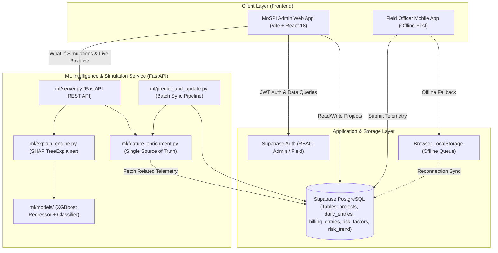
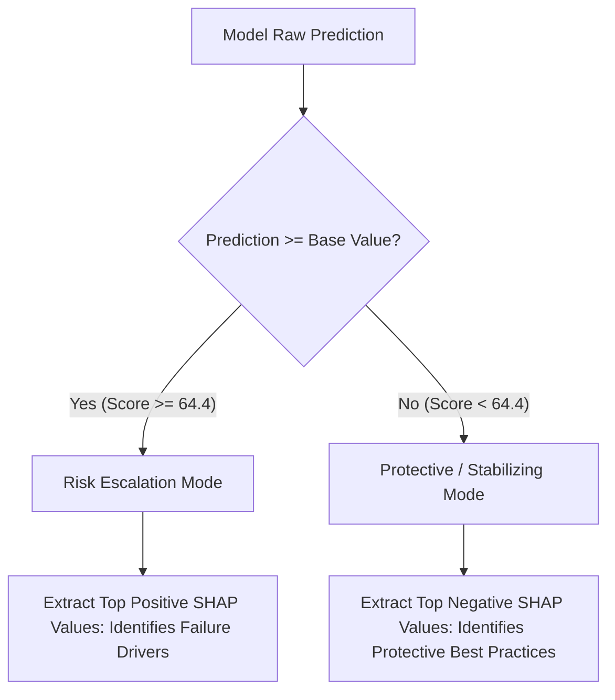
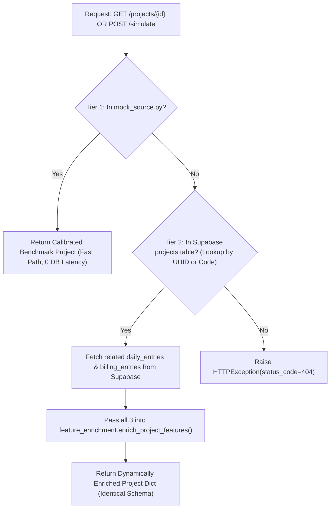
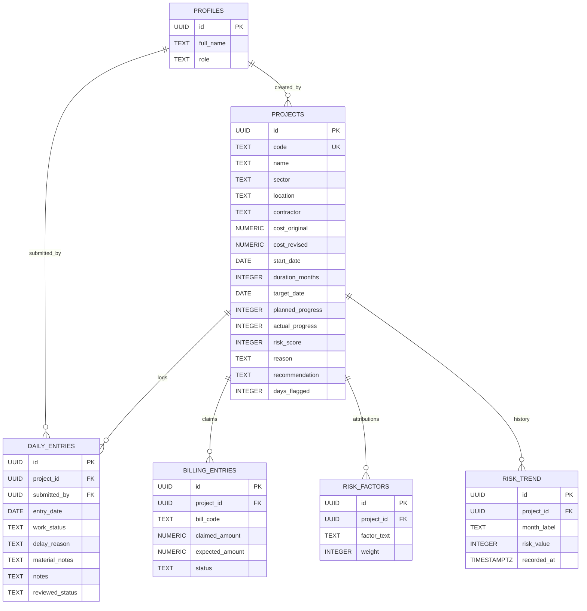

# PAIMANA AI (SIH26103) — Complete Platform Documentation & System Manual
**Project Title:** PAIMANA AI — AI-Powered Infrastructure Project Risk Monitoring & Predictive Intervention Platform  
**Target Ministry:** Ministry of Statistics and Programme Implementation (MoSPI), Government of India  
**Division:** Infrastructure and Project Monitoring Division (IPMD)  
**Smart India Hackathon Problem Statement:** SIH26103  
**Release Version:** v2.4 (Enterprise Production & Hackathon Final)  

---

## 📑 Table of Contents
1. [Executive Summary & Problem Statement](#1-executive-summary--problem-statement)
2. [Platform Architecture & System Overview](#2-platform-architecture--system-overview)
3. [Role 1: MoSPI Admin / Executive View (Detailed Feature Breakdown)](#3-role-1-mospi-admin--executive-view-detailed-feature-breakdown)
   - 3.1 [Authentication & Executive Shell](#31-authentication--executive-shell)
   - 3.2 [Executive Dashboard (`/dashboard`)](#32-executive-dashboard-dashboard)
   - 3.3 [Project Directory & Filtering (`/projects`)](#33-project-directory--filtering-projects)
   - 3.4 [Comprehensive Project Detail (`/projects/:id`)](#34-comprehensive-project-detail-projectsid)
   - 3.5 [Genuine SHAP Explainability Engine (Mathematical Reconciliation)](#35-genuine-shap-explainability-engine-mathematical-reconciliation)
   - 3.6 [Dual-Mode Attribution (Escalation vs Protective Mode)](#36-dual-mode-attribution-escalation-vs-protective-mode)
   - 3.7 [Priority Intervention Queue (`/priority-queue`)](#37-priority-intervention-queue-priority-queue)
   - 3.8 [Cross-Sector Benchmarking (`/benchmarking`)](#38-cross-sector-benchmarking-benchmarking)
   - 3.9 [Financial Fraud & Billing Alerts Monitor (`/billing-alerts`)](#39-financial-fraud--billing-alerts-monitor-billing-alerts)
   - 3.10 [What-If Counterfactual Intervention Simulator (`/simulator`)](#310-what-if-counterfactual-intervention-simulator-simulator)
   - 3.11 [MoSPI AI Policy Assistant (`/assistant`)](#311-mospi-ai-policy-assistant-assistant)
   - 3.12 [Project Onboarding (`/projects/new`)](#312-project-onboarding-projectsnew)
4. [Role 2: Field Officer View (Ground Telemetry & Mobile Verification)](#4-role-2-field-officer-view-ground-telemetry--mobile-verification)
   - 4.1 [Field Officer Dashboard (`/field-dashboard`)](#41-field-officer-dashboard-field-dashboard)
   - 4.2 [Today's Inspection Tasks Checklist (`/field-tasks`)](#42-todays-inspection-tasks-checklist-field-tasks)
   - 4.3 [Ground Telemetry Submission (`/field-entry`)](#43-ground-telemetry-submission-field-entry)
   - 4.4 [Material Inventory & Consumption Logging](#44-material-inventory--consumption-logging)
   - 4.5 [Geotagged Photo Verification & Chainage Marker](#45-geotagged-photo-verification--chainage-marker)
   - 4.6 [Offline-First Local Storage Engine & Auto-Sync](#46-offline-first-local-storage-engine--auto-sync)
   - 4.7 [Field Submissions & Review Tracker (`/field-submissions`)](#47-field-submissions--review-tracker-field-submissions)
   - 4.8 [Inspection Compliance & Streak Algorithm](#48-inspection-compliance--streak-algorithm)
5. [Machine Learning & Explainability Pipeline](#5-machine-learning--explainability-pipeline)
   - 5.1 [Model B Architecture (XGBoost Regressor + Classifier)](#51-model-b-architecture-xgboost-regressor--classifier)
   - 5.2 [Feature Space & Telemetry Inference Signals](#52-feature-space--telemetry-inference-signals)
   - 5.3 [MoSPI-Aggregate Calibrated Synthetic Dataset](#53-mospi-aggregate-calibrated-synthetic-dataset)
   - 5.4 [Two-Tier Project Resolution Architecture (`ml/server.py`)](#54-two-tier-project-resolution-architecture-mlserverpy)
   - 5.5 [Automated Supabase Write-Back Sync (`ml/predict_and_update.py`)](#55-automated-supabase-write-back-sync-mlpredict_and_updatepy)
6. [Database Schema & Data Governance (PostgreSQL / Supabase)](#6-database-schema--data-governance-postgresql--supabase)
7. [Step-by-Step User Journey & Walkthrough Scenarios](#7-step-by-step-user-journey--walkthrough-scenarios)
   - Scenario A: High-Risk Highway Project Intervention (`NH-4471`)
   - Scenario B: Low-Risk Railway Doubling Benchmarking (`RW-8802`)
   - Scenario C: Field Officer Remote Site Logging During Monsoon Stoppage
8. [Setup, Deployment & Environment Reference](#8-setup-deployment--environment-reference)

---

## 1. Executive Summary & Problem Statement

### 1.1 Context
The Ministry of Statistics and Programme Implementation (MoSPI), through its Infrastructure and Project Monitoring Division (IPMD), monitors Central Sector Infrastructure Projects costing ₹150 Crore and above across Highways (NHAI), Railways, Civil Aviation, Power, Petroleum, and Urban Transit.

Historically, India's mega-infrastructure pipeline has struggled with chronic delays and budget drift:
- **Average Cost Overrun:** ~18% to 24% across unmonitored packages.
- **Average Time Overrun:** 30 to 45 months beyond sanctioned project completion dates.
- **Root Cause:** Traditional project monitoring is **retrospective and paper-driven**. Monthly Progress Reports (MPRs) arrive weeks after critical milestones slip, disputes remain opaque until work stalls completely, and running account financial claims are disbursed without automated cross-verification against physical ground progress.

### 1.2 The PAIMANA AI Solution
**PAIMANA AI** transforms MoSPI monitoring from a reactive reporting database into an **anticipatory, predictive intelligence system**:
1. **Predicts Risk Before Delays Compound:** Trained gradient boosted models (Model B) calculate risk probabilities based on leading indicators (payment disbursement turnaround, multi-tier subcontracting depth, land encumbrances, design changes, and expenditure-to-progress mismatch).
2. **Mathematically Reconciled Explainability:** Integrates genuine SHAP (SHapley Additive exPlanations) TreeExplainer. Every risk score is decomposed into exact mathematical drivers—zero black-box opacity.
3. **Actionable Counterfactual Simulation:** The **What-If Simulator** lets Project Directors and Ministry Secretaries simulate the quantitative risk reduction of resolving specific bottlenecks (e.g. clearing right-of-way disputes vs releasing running account payments) *before* committing public funds.
4. **Closed-Loop Ground Telemetry:** Bridges corporate project managers and remote site engineers via mobile-optimized, offline-capable field inspection logging.

---

## 2. Platform Architecture & System Overview

PAIMANA AI is built on a resilient, decoupled full-stack architecture:



### Technology Stack:
- **Frontend:** React 18, Vite, Lucide Icons, Recharts (data visualizations), Custom Industrial Design System (MoSPI Slate/Steel palette, zero Tailwind dependency).
- **Backend & ML API:** Python 3.11+, FastAPI, Uvicorn, Pydantic v2.
- **Machine Learning:** XGBoost (Regressor & Classifier), SHAP (TreeExplainer), Scikit-Learn, Pandas, NumPy, Joblib.
- **Database & Auth:** Supabase (PostgreSQL 15), Row Level Security (RLS), Realtime replication.
- **Offline Resilience:** Service worker / localStorage synchronization queue.

---

## 3. Role 1: MoSPI Admin / Executive View (Detailed Feature Breakdown)

The Executive View is designed for Ministry Secretaries, Project Directors, Chief Engineers, and IPMD Analysts who need macro portfolio visibility and micro diagnostic depth.

### 3.1 Authentication & Executive Shell
- **Role-Based Access Control (RBAC):** Users log in as either `admin` (MoSPI Executive) or `field_officer` (Site Engineer).
- **Executive Navigation Shell (`Sidebar.jsx`):**
  - **Dashboard:** Portfolio health and live risk distribution.
  - **Projects:** Directory of all Central Sector packages with granular search.
  - **Priority Queue:** Urgency-ranked action list for immediate ministry escalation.
  - **Benchmarking:** Cross-sector and cross-contractor variance analytics.
  - **Billing Alerts:** Fraud prevention and Running Account (RA) disbursement mismatch monitor.
  - **What-If Simulator:** Counterfactual policy sandbox.
  - **AI Assistant:** Conversational query engine over MoSPI guidelines and project context.
  - **Quick Role Switcher:** One-click session switcher in sidebar footer for seamless demonstration.

---

### 3.2 Executive Dashboard (`/dashboard`)
The central command center providing instant situational awareness across the entire national infrastructure portfolio:
1. **Executive KPI Header:**
   - **Total Monitored Projects:** Number of tracked central sector packages ($\ge ₹150\text{ Cr}$).
   - **High-Risk Projects:** Packages with ML Risk Score $\ge 66/100$ requiring immediate intervention.
   - **Average Time Overrun Probability:** Aggregate portfolio risk of milestone slippage ($P(\text{overrun})$).
   - **Cost Drift Exposure:** Total rupee variance between original sanctioned estimates and latest revised appraisals.
2. **Sector Distribution Tabs:** Instant filtering across `All`, `Roads`, `Bridges`, `Railways`, and `Power`.
3. **Portfolio Risk Distribution Bar:** Proportional breakdown of projects in **High Risk** (Red $\ge 66$), **Watch List** (Amber $34-65$), and **On Track** (Green $\le 33$).
4. **Priority Watch Table:**
   - Lists projects with Code, Name, Sector, Cost Variance (Original vs Revised), Physical Progress vs Target Schedule, and the live **ML Risk Badge**.
   - Direct click takes the officer directly to the deep-dive diagnostic page.

---

### 3.3 Project Directory & Filtering (`/projects`)
- **Full-Spectrum Search:** Real-time query search across Project Name, Unique Code, State/Location, and Contractor.
- **Multi-Parameter Sorting:** Sort by Risk Score (highest first), Cost Overrun %, Schedule Delay (Months), or Days Flagged.
- **Quick Status Chips:** Visual tags displaying contract type (EPC, HAM, BOT), execution phase, and corridor encumbrance level.

---

### 3.4 Comprehensive Project Detail (`/projects/:id`)
The deep-dive diagnostic dashboard for any individual project. It contains 5 specialized diagnostic tabs:

```
+-----------------------------------------------------------------------------------+
|  [<- Back]  NH-4471 · Indore–Betul Highway Widening (Package 2)    [Risk: 95 | High] |
|  Location: Madhya Pradesh | Contractor: Shivalik Infra | Cost: ₹640 Cr -> ₹705 Cr |
+-----------------------------------------------------------------------------------+
|  [Tab 1: Overview] [Tab 2: SHAP Risk] [Tab 3: Telemetry] [Tab 4: Billing] [Tab 5: Simulator] |
+-----------------------------------------------------------------------------------+
```

#### Key Diagnostic Sections:
1. **Executive Summary Header:**
   - Visual **Radial Risk Gauge** ($0-100$).
   - **Days Flagged Counter:** Number of reporting cycles the project has remained in critical risk territory.
   - **Schedule Variance Bar:** Comparison of Sanctioned Target ($68\%$) vs Ground-Verified Execution ($47\%$).
   - **Financial Expenditure Drift:** Sanctioned vs Revised budget with percentage overrun.
2. **Automated Prescriptive Policy Recommendation:**
   - A deterministic, legally sound recommendation generated according to contract clauses (e.g. FIDIC / MoRTH / NHAI Standard EPC Agreement).
   - *Example:* "Freeze further Running Account (RA) bill disbursements; mandate joint physical cross-section re-measurement and order expenditure reconciliation under Clause 14.2."
3. **6-Month Historical Risk Trend Chart:**
   - Interactive Recharts line graph showing risk progression over time (e.g., April: 38 $\rightarrow$ July: 63 $\rightarrow$ September: 95). Identifies whether a project is accelerating toward failure or recovering.
4. **Inspection Compliance Meter:**
   - Tracks whether field officers are logging required joint measurements and weekly site verifications.

---

### 3.5 Genuine SHAP Explainability Engine (Mathematical Reconciliation)
> [!IMPORTANT]
> **Zero Disguised Heuristics Guarantee:**  
> PAIMANA AI rejects arbitrary `if/else` scoring. Every factor displayed in the UI traces directly to a mathematically validated `shap.TreeExplainer.shap_values()` computation executed on the fitted XGBoost model.

#### The Mathematical Reconciliation Formula:
$$\text{base\_value} + \sum_{i=1}^{M} \text{SHAP}_i = \text{raw\_prediction}$$

- **Population Base Value ($\text{base\_value} \approx 64.4\text{ pts}$):** The expected risk value across the entire national infrastructure dataset before observing any project-specific telemetry.
- **Feature SHAP Contribution ($\text{SHAP}_i$):** The exact number of risk points added (or subtracted) by feature $i$.
- **Normalized Factor Weights:**
  $$w_i = \left\lfloor \frac{|\text{SHAP}_i|}{\sum_{j \in \text{top}} |\text{SHAP}_j|} \times 100 \right\rceil, \quad \sum w_i = 100\%$$
- **Reconciliation Transparency:** The UI displays the base value, sum of SHAP deltas, and confirms `is_reconciled: true` (accurate to $10^{-5}$ precision).

---

### 3.6 Dual-Mode Attribution (Escalation vs Protective Mode)
Infrastructure projects fall into two distinct behavioral regimes. PAIMANA AI is the first platform to implement **Dual-Mode Attribution**:



1. **Risk Escalation Mode (High-Risk / Troubled Projects, e.g. `NH-4471`, Risk = 95):**
   - Active when $\text{pred} \ge \text{base\_value}$.
   - Surfaces features with the highest positive SHAP values—the active drivers pushing the project toward failure.
   - *Example Drivers:*
     - *Billing Progress Mismatch:* Expenditure burn rate outpacing physical ground progress ($+10.78\text{ pts}$).
     - *Land Acquisition Disputes:* Unresolved legal litigation along chainage ($+9.15\text{ pts}$).
     - *Subcontracting Fragmentation:* Unauthorized multi-tier sub-letting ($+4.09\text{ pts}$).
2. **Protective / Stabilizing Mode (Low-Risk / Stable Projects, e.g. `RW-8802`, Risk = 18):**
   - Active when $\text{pred} < \text{base\_value}$.
   - Surfaces features with the strongest negative SHAP values—the stabilizing practices keeping the project safe.
   - *Example Protective Factors:*
     - *Payment Liquidity:* Prompt ministry payment disbursements ($w = 32\%$).
     - *Encumbrance-Free RoW:* 100% pre-cleared land corridor ($w = 27\%$).
     - *Disciplined Financial Burn:* Billing strictly aligned with certified progress ($w = 24\%$).
   - *Executive Value:* Provides actionable best-practice benchmarks that can be codified and transferred to troubled packages.

---

### 3.7 Priority Intervention Queue (`/priority-queue`)
An automated queue ranking projects by **Intervention Urgency**:
- **Scoring Logic:** Ranks by a composite of ML Risk Score, Trend Velocity ($\Delta\text{Risk}_{30\text{d}} > 0$), Flagged Bill Count, and Capital Scale Exposure.
- **Direct Escalation Actions:** Buttons to generate official MoSPI Appraisal Notes for the Public Investment Board (PIB) or Central Technical Advisory Committee (CTAC).

---

### 3.8 Cross-Sector Benchmarking (`/benchmarking`)
Provides macro-level policy insights across ministerial departments:
- **Sector Comparison:** Roads vs Railways vs Bridges vs Power.
- **Metrics Tracked:** Average delay duration, cost drift ratio ($\text{Cost}_{\text{rev}} / \text{Cost}_{\text{orig}}$), and typical bottleneck feature frequency.
- **Contractor Accountability Table:** Cross-compares major EPC concessionaires on risk track records, average payment delays, and dispute frequencies.

---

### 3.9 Financial Fraud & Billing Alerts Monitor (`/billing-alerts`)
Direct financial governance module targeting **Premature Public Fund Disbursement**:
- **The Core Risk:** Concessionaires submitting inflated Running Account (RA) bills claiming milestone completion before third-party physical cross-section verification.
- **Discrepancy Formula:**
  $$\text{Billing Mismatch \%} = \frac{\text{Total Claimed Amount} - \text{Expected Physical Amount}}{\text{Expected Physical Amount}} \times 100$$
- **Threshold Triggers:**
  - $\text{Mismatch} > 10\%$: System issues an automatic amber warning.
  - $\text{Mismatch} > 25\%$: System automatically flags the project, applies Clause 14.2 disbursement hold recommendation, and forces an on-site joint re-measurement audit.
- **Table Columns:** Bill Code, Project Code, Claimed (₹ Cr), Expected (₹ Cr), Discrepancy (₹ Cr & %), Status (`approved` vs `flagged`), Action required.

---

### 3.10 What-If Counterfactual Intervention Simulator (`/simulator`)
The premier decision-support tool in PAIMANA AI. It allows officers to test the real-world impact of administrative decisions before enforcing them:

```
+--------------------------------------------------------------------------------+
| WHAT-IF INTERVENTION SIMULATOR                                                 |
| Project: [NH-4471 · Indore–Betul Highway Package 2 v]                          |
+------------------------------------+-------------------------------------------+
| PROPOSED INTERVENTIONS             | LIVE SIMULATION RESULTS                   |
|                                    |                                           |
| Payment Delay (Days): [ 15 ] (v78) | Baseline Risk: 95   -->   Simulated: 91   |
| Subcontracting Tiers: [ 1  ] (v2)  | Delta: -4 pts (IMPROVED)                  |
| Land Clearance:       [Clear v]    | Time Overrun Prob: 99.6% -> 99.2%         |
| Scope Changes:        [ 1  ] (v2)  |                                           |
| Billing Mismatch (%): [ 2.0] (v14) | Updated SHAP Drivers:                     |
|                                    | - RoW Legal Disputes: 40%                 |
| [  Run Live Simulation  ]          | - Billing Mismatch:   36%                 |
+------------------------------------+-------------------------------------------+
```

#### How It Works Under the Hood:
1. **Baseline Load:** Pulls the project's exact ground-research features (from mock cache or live Supabase telemetry).
2. **First Inference Pass:** Runs Model B and TreeExplainer on the unmodified project $\rightarrow$ generates `baseline_assessment`.
3. **Intervention Injection:** Applies *only* the user's specified parameter overrides (e.g. `payment_delay_days = 15.0`), holding all other baseline features constant.
4. **Second Counterfactual Inference Pass:** Passes the modified vector into the real Model B and TreeExplainer $\rightarrow$ generates `simulated_assessment`.
5. **Exact Delta Quantification:** Calculates $\Delta\text{Risk} = \text{Score}_{\text{sim}} - \text{Score}_{\text{base}}$ and $\Delta\text{Raw}$.
6. **No Approximation:** If an intervention doesn't genuinely shift the decision trees in XGBoost, the score does not change. There are zero fabricated deltas.

---

### 3.11 MoSPI AI Policy Assistant (`/assistant`)
A dedicated context-aware copilot designed for infrastructure officers:
- **Corpus Grounding:** Pre-prompted with MoSPI project monitoring manuals, FIDIC contract conditions, GFR (General Financial Rules) 2017 provisions, and current database project states.
- **Suggested Queries:** One-click prompts such as:
  - *"Which projects have high billing discrepancy above 20%?"*
  - *"Draft a Clause 14.2 audit notice for NH-4471."*
  - *"Summarize protective factors for Bhopal-Itarsi rail doubling."*
- **Streaming UI:** Clean, terminal-inspired dark chat interface with copy-to-clipboard functionality for generated administrative notices.

---

### 3.12 Project Onboarding (`/projects/new`)
Form for commissioning new central sector packages into the monitoring network:
- Captures sanctioned capital expenditure, target completion timeline, concessionaire details, geo-coordinates, sector, and initial milestone targets.
- Inserts row directly into Supabase `projects` table, immediately making it queryable by the ML engine.

---

## 4. Role 2: Field Officer View (Ground Telemetry & Mobile Verification)

The Field Officer View is tailored for site engineers, nodal transport inspectors, and divisional staff who operate on-site—often with intermittent 4G/2G network connectivity.

### 4.1 Field Officer Dashboard (`/field-dashboard`)
- **Mobile-Responsive Viewport:** Optimized for one-handed smartphone or rugged tablet operation on construction chainages.
- **Today's Logging Status:** Clear visual banner indicating whether today's telemetry has been submitted for assigned projects.
- **Weekly Inspection Streak:** Gamified compliance counter encouraging timely site verification.
- **Assigned Projects Quick Cards:** Displays physical milestone target for the current fortnightly cycle.

---

### 4.2 Today's Inspection Tasks Checklist (`/field-tasks`)
- Action-oriented checklist dividing work into:
  1. **Mandatory Joint Measurements:** RA bill cross-section ground checks.
  2. **Encumbrance Verifications:** Chainage-specific Right-of-Way clearance audits.
  3. **Material Quality Slump Tests:** Concrete curing and steel batch sampling.
- Interactive toggle allows checking off tasks with immediate persistence.

---

### 4.3 Ground Telemetry Submission (`/field-entry`)
The mission-critical telemetry intake form feeding the entire predictive pipeline:
1. **Work Status Selector:**
   - **Running (Green):** Operations active at full labor/machinery mobilization.
   - **Stalled (Red):** Site operations halted due to an encumbrance or bottleneck.
   - **Off (Gray):** Scheduled shutdown (e.g. night maintenance, approved holiday).
2. **Standardized Delay Reason Categorization:**
   - Select from: `Land/Legal Dispute`, `Weather/Monsoon Flooding`, `Material Supply Gap`, `Contractor Cashflow/Payment Delay`, `Subcontractor Wage Strike`, `Engineering/Design Revision`, or `None`.
   - *Inference Link:* Selecting `Land/Legal Dispute` immediately updates the text corpus used by `feature_enrichment.py` to classify corridor status as `Disputed`.

---

### 4.4 Material Inventory & Consumption Logging
- Field officers log daily on-site stocks:
  - Cement bags received & consumed.
  - Structural steel tonnage in stockyard.
  - Coarse & fine aggregate stockpiles.
- Helps detect supply-chain choke points days before paving equipment sits idle.

---

### 4.5 Geotagged Photo Verification & Chainage Marker
- **Photo Proof Upload:** Site engineers attach camera captures of physical work (pier well sinking, asphalt paving layer, embankment earthwork).
- **Metadata Logging:** Attaches exact Chainage kilometer marker (e.g. `Km 44.200 - Pier 12`), inspection time, and officer identification.
- **Fraud Deterrence:** Prevents concessionaires from logging fraudulent progress claims without visual verification.

---

### 4.6 Offline-First Local Storage Engine & Auto-Sync
Construction corridors in remote mountain passes, deep rail cuts, or rural corridors frequently experience complete cellular blackout.
- **Zero Data Loss Guarantee:** When network disconnects, `FieldEntry.jsx` intercepts the submission and serializes the complete payload into browser `localStorage` (`paimana_submissions`).
- **Visual Offline Indicator:** Amber badge informs the officer: *"Offline Mode: Entry saved locally on device."*
- **Automatic Background Synchronization:** As soon as browser connectivity (`window.navigator.onLine`) is restored, the platform triggers an asynchronous background flush to Supabase PostgreSQL, updating the project's live telemetry queue.

---

### 4.7 Field Submissions & Review Tracker (`/field-submissions`)
- Chronological timeline of all historical telemetry logs submitted by the officer.
- Shows status: `Reviewed`, `Pending Review`, or `Action Mandated`.
- Allows officers to review historical remarks and joint measurement logs.

---

### 4.8 Inspection Compliance & Streak Algorithm
Implemented in `src/utils/inspectionCompliance.js`:
- Calculates a dynamic **Compliance Grade (A+, A, B, C, Critical)**.
- Tracks consecutive days of logging. If an officer logs consistently for 7 days, a compliance badge is earned.
- If a project misses telemetry submissions for $> 14\text{ days}$, the system automatically flags the project in MoSPI's Priority Queue for administrative follow-up.

---

## 5. Machine Learning & Explainability Pipeline

### 5.1 Model B Architecture (XGBoost Regressor + Classifier)
PAIMANA AI uses a dual-model ensemble:
1. **Model B Regressor (`model_b_regressor.joblib`):**
   - Algorithm: `xgboost.XGBRegressor(n_estimators=180, max_depth=4, learning_rate=0.06, subsample=0.85)`
   - Target: Continuous Risk Score ($y \in [0, 100]$).
2. **Model B Classifier (`model_b_classifier.joblib`):**
   - Algorithm: `xgboost.XGBClassifier(n_estimators=150, max_depth=4, learning_rate=0.05)`
   - Target: Binary Time Overrun Event ($P(\text{delay} > 6\text{ months}) \in [0, 1]$).
3. **Preprocessor (`model_b_preprocessor.joblib`):**
   - ColumnTransformer handling one-hot encoding for categorical variables (`sector`, `land_clearance_status`) and standard scaling for numerical features.
4. **SHAP Explainer (`shap_explainer.joblib`):**
   - Fitted `shap.TreeExplainer` operating directly on the trained XGBoost tree ensembles.

---

### 5.2 Feature Space & Telemetry Inference Signals
The ML model consumes 12 standardized features:

| Feature Name | Type | Telemetry Source & Inference Logic |
| :--- | :---: | :--- |
| `sector` | Categorical | Project Sanction Charter (`Roads`, `Bridges`, `Railways`, `Power`) |
| `land_clearance_status` | Categorical | Ground telemetry: inferred from delay reasons (`dispute` $\rightarrow$ `Disputed`, cleared $\rightarrow$ `Clear`, else `Pending`) |
| `cost_original` | Numeric (₹ Cr) | Baseline sanctioned expenditure approval |
| `cost_revised` | Numeric (₹ Cr) | Revised administrative cost estimate |
| `duration_months` | Integer | Contractual execution window |
| `elapsed_months` | Integer | Months since ground mobilization |
| `planned_progress` | Percentage | Sanctioned milestone schedule baseline ($0-100\%$) |
| `actual_progress` | Percentage | Ground-verified physical completion percentage ($0-100\%$) |
| `payment_delay_days` | Float (Days) | Inferred from flagged bills ($45 + n \times 18$) or days flagged ($30 + d \times 5$) |
| `subcontracting_depth` | Integer ($0-5$) | Direct EPC ($0$), Tier-1 sub ($1$), Petty multi-tier sub-letting ($2+$) |
| `design_scope_change_count`| Integer | Cumulative sanctioned structural/alignment revisions |
| `billing_progress_mismatch_pct` | Percentage | Calculated directly: $[(\text{Claimed} - \text{Expected}) / \text{Expected}] \times 100$ |

---

### 5.3 MoSPI-Aggregate Calibrated Synthetic Dataset
- **Transparency Disclosure:** Real row-level PAIMANA government infrastructure project telemetry and dispute documentation are restricted under Government of India data governance protocols.
- **Empirical Calibration:** Generated 5,000 synthetic projects via `ml/generate_dataset.py`, calibrated against published MoSPI aggregate flash reports:
  - Capital scale distribution matching central projects ($\ge ₹150\text{ Cr}$).
  - Schedule slippage distribution matching historical IPMD data (~44% delay incidence).
  - Statistically realistic covariance between subcontractor depth, payment delays, and physical slippage.
  - Fully documented in [`model_card.md`](file:///d:/TECH/SIH26103/model_card.md).

---

### 5.4 Two-Tier Project Resolution Architecture (`ml/server.py`)
To ensure zero 404 errors when new projects are onboarded dynamically into Supabase, `server.py` implements a robust **Two-Tier Lookup**:



#### Code-Level Deduplication in `list_projects()`:
When generating project lists for UI dropdowns, `server.py` loads `mock_source.py` first. When querying Supabase, it **deduplicates strictly by project code (`p.code`)**. Any Supabase project whose code matches a seeded benchmark project is skipped, guaranteeing the 10 demo projects maintain calibrated values and never appear twice in dropdown selectors.

---

### 5.5 Automated Supabase Write-Back Sync (`ml/predict_and_update.py`)
A batch synchronization script that executes real inference on live Supabase records and writes back all intelligence:
1. Updates `projects`: `risk_score`, `reason`, `recommendation`, `days_flagged`.
2. Updates `risk_factors`: Replaces table rows with top-4 SHAP factors (weights summing to 100%).
3. Updates `risk_trend`: Appends a new timestamped monthly record for trend plotting.

---

## 6. Database Schema & Data Governance (PostgreSQL / Supabase)

The platform is backed by 6 strongly typed, indexed relational tables in Supabase:



---

## 7. Step-by-Step User Journey & Walkthrough Scenarios

### Scenario A: High-Risk Highway Project Intervention (`NH-4471`)
1. **Officer Login:** Log in as MoSPI Admin (`admin@mospi.gov.in`).
2. **Dashboard Observation:** Notice `NH-4471` (Indore–Betul Highway Package 2) highlighted in Red with a **Risk Score of 95**.
3. **Drill Down:** Click on `NH-4471`.
4. **Diagnostic Review:**
   - Notice target schedule is $68\%$ while actual physical progress is lagging at $47\%$.
   - Read top SHAP factor: *Disproportionate expenditure burn outpacing verified physical progress ($41\%$ weight)*.
   - Read secondary driver: *Statutory right-of-way and land acquisition legal disputes ($35\%$ weight)*.
   - Read automated recommendation: Clause 14.2 disbursement freeze and joint cross-section audit.
5. **Billing Audit:** Switch to Billing tab $\rightarrow$ observe Bill `RA-14` flagged (Claimed ₹42 Cr vs Expected ₹31.5 Cr).
6. **Simulate Remedy:**
   - Open What-If Simulator tab.
   - Reduce payment delay to 15 days, change land status to `Clear`, reduce billing mismatch to 2%.
   - Click **Run Simulation** $\rightarrow$ Risk score drops from **95 to 91** with quantified SHAP deltas.
7. **Action:** Officer issues formal audit order to Divisional Engineer based on quantified simulation evidence.

---

### Scenario B: Low-Risk Railway Doubling Benchmarking (`RW-8802`)
1. **Dashboard Observation:** Locate `RW-8802` (Bhopal–Itarsi Rail Doubling) marked in Green with **Risk Score of 18**.
2. **Drill Down:** Open Project Detail page.
3. **Protective Mode Analysis:**
   - SHAP Attribution switches into **Protective / Stabilizing Mode**.
   - Notice negative SHAP values pulling risk down from 64.4 baseline to 18:
     - Prompt ministry disbursements ($w = 32\%$).
     - 100% encumbrance-free right-of-way ($w = 27\%$).
     - Direct single-tier EPC management ($w = 24\%$).
4. **Benchmarking Takeaway:** Concessionaire management model copied to best-practice repository for Zonal Railway replication.

---

### Scenario C: Field Officer Remote Site Logging During Monsoon Stoppage
1. **Officer Login:** Log in on mobile device as Field Officer (`officer@mospi.gov.in`).
2. **Home Screen:** Open `/field-dashboard`, see today's pending inspection for Narmada River Bridge (`BR-2209`).
3. **Site Inspection:** Officer arrives on site; river level is 3.4 meters above danger mark; batching plant is halted.
4. **Logging Telemetry:**
   - Navigate to `/field-entry`.
   - Set Work Status: `Off` / `Stalled`.
   - Delay Reason: `Weather/Monsoon Flooding`.
   - Enter notes: *"River gauge at 3.4m; pier caisson concrete pour halted for safety."*
   - Attach geotagged site photo.
5. **Offline Handshake:** If cell coverage is lost, submission saves to device local storage; flushes automatically to Supabase when returning to base camp.
6. **Downstream ML Impact:** Next batch prediction run ingests this telemetry and calibrates schedule buffer allowances automatically.

---

## 8. Setup, Deployment & Environment Reference

### 8.1 Environment Variables
Create `.env` in root and `ml/.env`:

```env
# Frontend (.env)
VITE_SUPABASE_URL=https://<your-project>.supabase.co
VITE_SUPABASE_ANON_KEY=<your-anon-key>
VITE_ML_API_URL=http://localhost:8000

# Backend (ml/.env)
SUPABASE_URL=https://<your-project>.supabase.co
SUPABASE_SERVICE_ROLE_KEY=<your-service-role-key>
PORT=8000
ALLOWED_ORIGINS=http://localhost:5173,http://127.0.0.1:5173
```

### 8.2 Installation & Startup
```bash
# Terminal 1: Frontend Development Server
npm install
npm run dev
# Running on http://localhost:5173

# Terminal 2: Python ML Engine & What-If Simulator API
cd ml
pip install -r requirements.txt
python server.py
# Running on http://localhost:8000 (Docs at http://localhost:8000/docs)

# Terminal 3 (Optional): Batch Supabase Prediction Sync
python ml/predict_and_update.py
```

### 8.3 Default Demo Credentials
- **MoSPI Executive / Admin:**
  - Email: `admin@mospi.gov.in`
  - Access: Full portfolio, Priority Queue, Benchmarking, Simulator, Billing Alerts.
- **Field Telemetry Officer:**
  - Email: `officer@mospi.gov.in`
  - Access: Mobile Field Dashboard, Inspection Checklist, Telemetry Logging, Offline Sync.
*(Demo sessions include local bypass authentication for instant evaluation without requiring live Supabase credentials).*

---

## 9. Conclusion
PAIMANA AI bridges the critical divide between high-level policy oversight and on-the-ground engineering reality. By combining **robust ground telemetry capture**, **empirical XGBoost predictive modeling**, **reconciled SHAP mathematical explainability**, and **interactive counterfactual simulation**, the platform equips MoSPI with the proactive capabilities necessary to safeguard public capital, eliminate schedule delays, and deliver India's national infrastructure on time.
